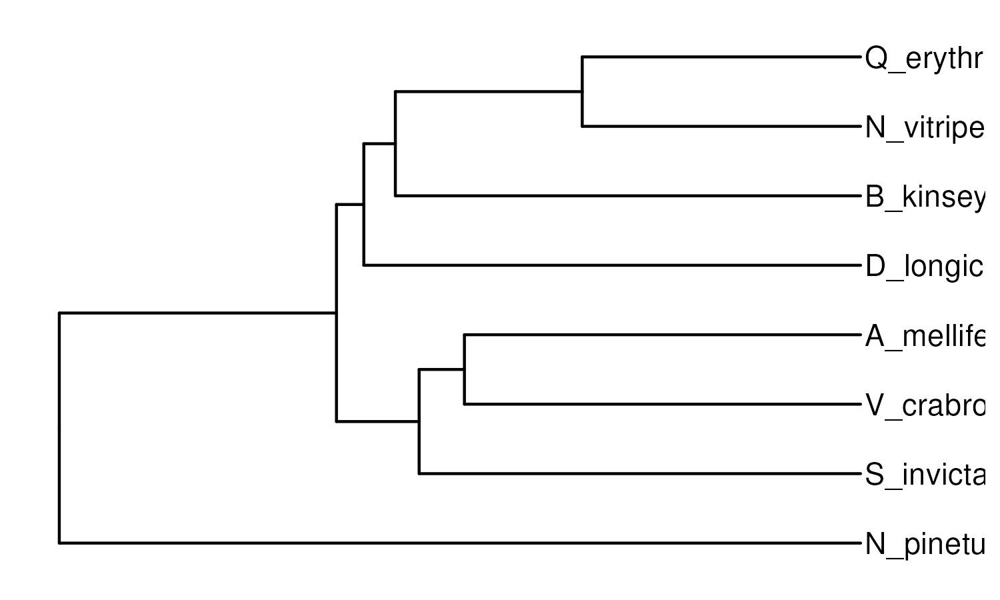

# Chromosome-scale alignments & repeatome variation

Whole genome alignments and repeatome analyses on hymenopteran chromosome-level genomes, with a focus on Quadrastichus erythrinae.

| Sample                       | Scaffold N50 | Sequences | Size Gb | Accession       |
| ---------------------------- | ------------ | --------- | ------- | --------------- |
| Quadrastichus_erythrinae     | 75.621       | 6         | 0.399   | This Study      |
| Nasonia_vitripennis          | 24.76        | 436       | 0.297   | GCF_009193385.2 |
| Belonocnema_kinseyi          | 150.973      | 5520      | 1.539   | GCF_010883055.1 |
| Diachasmimorpha_longicaudata | 7.964        | 246       | 0.194   | GCF_034640455.1 |
| Apis_mellifera               | 13.619       | 177       | 0.225   | GCF_003254395.2 |
| Vespa_crabro                 | 9.768        | 99        | 0.229   | GCF_910589235.1 |
| Solenopsis_invicta           | 26.227       | 219       | 0.378   | GCF_016802725.1 |
| Neodiprion_pinetum           | 41.401       | 112       | 0.272   | GCF_021155775.2 |

The phylogeny for ordering species is based on the species tree from orthofinder:

***Click each header to see outputs and code blocks.***

## [Repeat-level variation](code/repeats.md)

Repeat analyses first run earlgrey v6.3.5 and then extract repeat information from the `.gff` files.

* Plot high‑level repeat landscape across species (Proportion, Coverage, Family_Count), including version excluding B. kinseyi.

* Compute total repeat coverage per genome and run Spearman correlations between repeat bp and genome size.

* Fit PGLS models (λ estimated by ML) for log(GSize) ~ log(Repeats), both on full tree and with B. kinseyi removed; extract fitted values and λ.

* Plot genome size vs repeat content with trendline.

## [BUSCO-level whole genome alignments](code/busco_synteny.md)

First compare synteny at the BUSCO-level, identifying pairwise counts of BUSCO blocks between species. 

* Run BUSCO v5 with hymenoptera_db12 and telociraptor on all genomes to prep for [chromsyn](https://github.com/slimsuite/chromsyn/tree/main).

* Plot the number of conserved pairwise synteny blocks (requiring minimum 100kb BUSCO-blocks) among genomes using chromsyn. 

## [Reciprocal-best-hit genic alignments](code/genic_synteny.md)

Instead of focusing on BUSCOs, also examine whole-genic synteny using genome annotation `.gffs`.

* Extract cds for each species.

* Perform last alignments and extract reciprocal best hits using [jcvi](https://github.com/tanghaibao/jcvi/wiki/MCscan-(Python-version)#pairwise-synteny-visualization).

* Plot with jcvi. 

## Qs & Cs 

Questions or comments reach out to Justin Merondun heritabilities [@] gmail.com or make an issue here. 